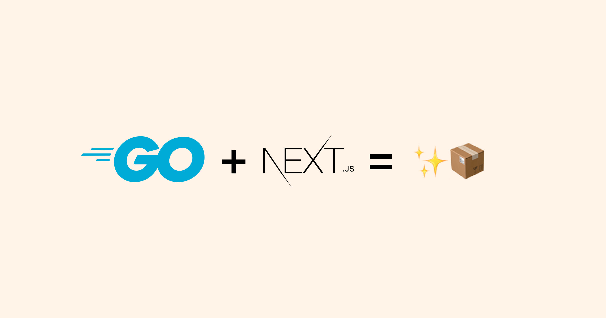

# Go - Next.js 

**gonext** is a small Go module to showcase the `embed` package
for bundling a Next.js app.

👉 Read the companion
[article](https://v0x.nl/articles/portable-apps-go-nextjs) that walks
through this project.



## Requirements

- Go 1.16
- Npm

## Installing

Clone or download the repository:

```sh
$ git clone git@github.com:tullo/gonext.git
```

## Usage

From the repository root directory, generate the static HTML export
of the Next.js app, and build the Go binary:

```sh
$ cd nextjs
$ npm install
$ npm run export
$ cd ..
$ go build
```

Then run the binary:

```sh
$ ././gonext

2021/05/03 13:53:12 Starting HTTP server at http://localhost:8000 ...
```

## License

[MIT](/LICENSE)
